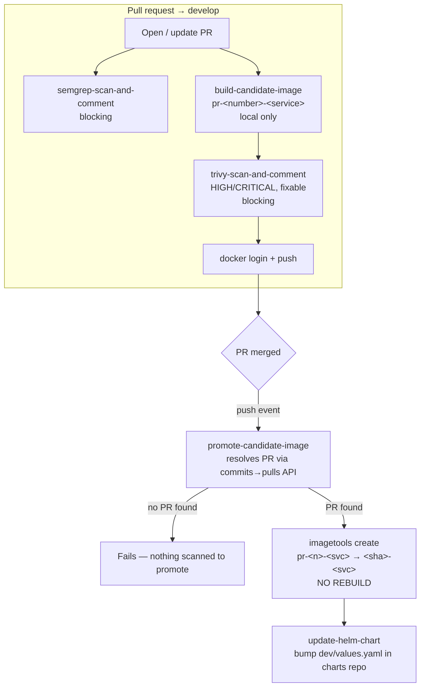

# Dev pipeline (`dev-pipeline.yml`)

PR into `develop` → scan → build → merge → promote → deploy.

The logic lives **once**, as the composite actions in
[`.github/actions/`](../../.github/actions/README.md); each repo's
`dev-pipeline.yml` is a thin caller rendered from
[the template](../../pipelines/templates/dev-pipeline.yml.tmpl). The
alternative — one file copy-pasted into fifteen repos — drifts: a gate gets
quietly disabled in one, a fix lands in three, nobody knows which are current.

## Build once, promote by digest

The deployed image is **never rebuilt**. It's built and scanned once, on the
PR. Merging retags that *same digest* via `docker buildx imagetools create` —
a registry-side manifest copy, not a build.

`build-candidate-image` also never pushes: build → scan → login → push, so an
image failing its Trivy gate never reaches the registry.

## Flow

## Actions, in order

| Step | Action | Notes |
|---|---|---|
| SAST | `semgrep-scan-and-comment` | configs matched to the repo's stack |
| Build | `build-candidate-image` | does not push |
| Container scan | `trivy-scan-and-comment` | blocking by default — this is the gate |
| Promote | `promote-candidate-image` | `push` only, after registry login |
| Values bump | `update-helm-chart` | direct commit to the charts repo |

`validate-branch-jira` exists but is opt-in — no template wires it in.

## Tags

| Tag | Format | Notes |
|---|---|---|
| Candidate | `pr-<number>-<service>` | stable across force-pushes; not for deploying |
| Release | `<commit-sha>-<service>` | the commit that landed on `develop`; what gets deployed |

## Why promotion resolves the PR via the API

`pull_request`'s `github.sha` is a synthetic merge SHA that never exists in
`develop`'s history, and walking back from a merge commit only works for
merge-commit strategy — it breaks silently under squash and rebase. So
`promote-candidate-image` asks GitHub which PR produced the commit
(`GET /repos/{owner}/{repo}/commits/{sha}/pulls`), which is correct for every
merge strategy.

## Failure modes (intentional)

A merge with no associated scanned candidate **fails before anything reaches
the registry or the charts repo** — fail-safe, not fail-open. That covers a
direct push to `develop`, and a PR opened before the repo adopted this
pipeline. Fix the latter by pushing one more commit to the PR before merging.

## Registry

GHCR at `ghcr.io/${{ github.repository }}`, pushed with `GITHUB_TOKEN` and
`packages: write` — nothing to provision.

- **GHCR paths must be lowercase.** If your owner or repo name has uppercase
  letters, set `IMAGE_NAME` explicitly in the workflow's `env:`.
- **The first push creates a private package.** Fine for the promote step;
  anything pulling from outside the repo needs its access widened once.

## Charts repo

`update-helm-chart` commits to a separate charts repo, so `GITHUB_TOKEN` can't
be used — the job mints a GitHub App token per run
([setup](github-app-setup.md), required).

Every app repo pushes to the same branch there, so concurrent merges race. The
action fetches, resets to the latest remote state, re-applies its one-key
edit, and retries — re-applying rather than rebasing, so a concurrent bump to
a different service can't conflict.

## Configuration

Per-repo and fleet-wide settings live in
[`pipelines/repos.yaml`](../../pipelines/repos.yaml) — see
[install-pipeline](install-pipeline.md). `develop` appears throughout this doc
but comes from `integration_branch` and is configurable.
