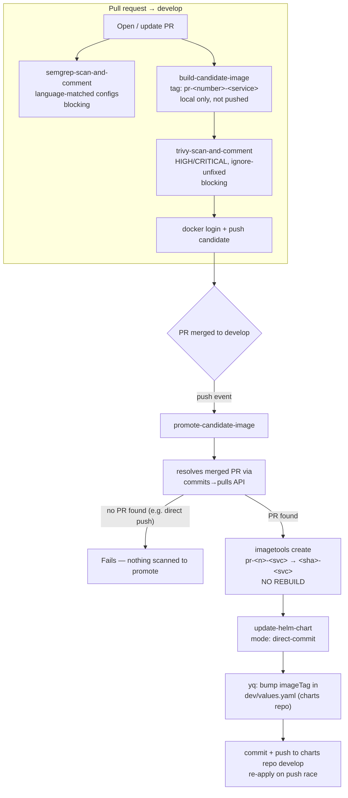

# Dev pipeline (`dev-pipeline.yml`)

The dev-stage pipeline every app repo runs: PR into `develop` → scan → build
→ merge → promote → deploy. The logic lives **once**, as the composite
actions in [`.github/actions/`](../../.github/actions/README.md); each repo's
`dev-pipeline.yml` is a thin caller generated from
[`pipelines/templates/dev-pipeline.yml.tmpl`](../../pipelines/templates/dev-pipeline.yml.tmpl).

The alternative — one template copy-pasted independently into every repo — is
what this design exists to avoid. Copies drift: security gates get quietly
neutralized with `continue-on-error: true` in one repo, a tagging fix lands in
three of fifteen, and nobody can tell which repos are current.

## Design principle: build once, promote by digest

The image that gets deployed is **never rebuilt**. It is built and scanned
exactly once, on the PR that introduces it. Merging to `develop` doesn't
produce a new image — it retags the *same* digest that was already scanned,
via `docker buildx imagetools create` (a registry-side manifest copy, not a
build — no layers re-upload, no daemon build runs). That's what
`promote-candidate-image` does; the composite actions exist specifically so
this guarantee is enforced in one place rather than trusted to survive
copy-paste into fifteen repos.

The same principle shapes the build step: `build-candidate-image` does not
push. The image is built, scanned locally, and only then does the job log in
and push. An image that fails its Trivy gate never reaches the registry at
all.

## Flow

## Actions used, in order

| Step | Action | Notes |
|---|---|---|
| SAST | `semgrep-scan-and-comment` | `semgrep-configs` matched to the repo's actual stack, from `pipelines/repos.yaml` |
| Build | `build-candidate-image` | Does not push — the caller logs in and pushes as its own step, after the scan |
| Container scan | `trivy-scan-and-comment` | `fail-on-findings: true` by default — this is the gate |
| Promote | `promote-candidate-image` | Run only on `push` to `develop`, after registry login |
| Values bump | `update-helm-chart` | `mode: direct-commit` (default) — pushes straight to `develop` in the charts repo |

`validate-branch-jira` exists but is **opt-in** — no template wires it in.

## Tagging scheme

- **Candidate tag** — `pr-<PR number>-<service>` (e.g. `pr-42-api`). Stable
  across force-pushes to the PR branch; always the last commit actually
  scanned. Not meant to be deployed directly.
- **Release tag** — `<commit-sha>-<service>`, the real commit that landed on
  `develop` (from the `push` event's SHA, not `pull_request`'s synthetic
  merge-ref SHA). This is what the charts repo's values file points at.

## Why promotion is resolved by PR number, not by walking the merge commit

`pull_request`'s `github.sha` is a synthetic merge-commit SHA that never
exists in `develop`'s history, and walking back from a real merge commit to
the PR branch tip only works for GitHub's "create a merge commit" strategy —
it silently breaks under squash or rebase merges. `promote-candidate-image`
instead asks GitHub directly which PR produced this commit
(`GET /repos/{owner}/{repo}/commits/{sha}/pulls`), which is correct
regardless of merge strategy.

## Failure modes (intentional)

- **Direct push to `develop`** (bypassing a PR): no associated PR is found,
  so there's no scanned candidate to promote. The job fails before anything
  reaches the registry or the charts repo — fail-safe, not fail-open.
- **PR merged without a fresh scan run** (e.g. a PR opened before the repo
  adopted this pipeline): same failure, same reason — no
  `pr-<number>-<service>` candidate exists. Push one more commit to the PR
  before merging.

## Registry notes

The templates target GHCR at `ghcr.io/${{ github.repository }}`, pushed with
`secrets.GITHUB_TOKEN` and a `packages: write` job permission — no external
registry credential to provision or rotate.

Two things to know:

- **GHCR paths must be lowercase.** `${{ github.repository }}` is used as-is,
  so if your owner or repo name contains uppercase letters, set `IMAGE_NAME`
  explicitly in the workflow's `env:` block.
- **The first push creates a private package.** For the promote step to read
  the candidate back, nothing extra is needed (same repo, same token), but
  anything *outside* the repo pulling that image needs the package's access
  settings widened manually, once.

The actions themselves are registry-agnostic — they only require the job to
have logged in. Pointing them at ECR, Docker Hub, or a private registry means
swapping the login step and `REGISTRY`/`IMAGE_NAME`, nothing more.

## The values file lives in a separate charts repo

`update-helm-chart` commits to a dedicated Helm-charts repo
(`atkaridarshan04/test-helm-charts` in the templates), not into the app repo.
Two consequences worth knowing up front:

- **`GITHUB_TOKEN` cannot be used.** It is scoped to the repo whose workflow
  generated it, so the job mints a short-lived GitHub App token per run
  instead. This is required setup, not optional — see
  [`github-app-setup.md`](github-app-setup.md).
- **Every app repo pushes to the same branch of that one repo.** Two merges
  landing close together will race on a non-fast-forward push, so
  `update-helm-chart` fetches, resets to the latest remote state, re-applies
  the one-key edit, and retries — up to five times. Re-applying rather than
  rebasing means a concurrent bump to a *different* service can never produce
  a merge conflict.

Keeping deploy config out of the app repo also means the pipeline never
commits into the branch that triggers it, so there's no self-triggering loop
to guard against.

## Per-repo configuration

Build args, Semgrep configs, the values-file key, and any Dockerfile target
live in [`pipelines/repos.yaml`](../../pipelines/repos.yaml), one entry per
repo, under a `repos:` map. Fleet-wide settings — the integration branch
(`develop` throughout this doc, but configurable), the charts repo, and the
runner label — live in the `defaults:` block above it.
`scripts/install-pipeline.sh` renders the template against that entry — see
[`install-pipeline.md`](install-pipeline.md). The QA stage is documented in
[`qa-release.md`](qa-release.md).
