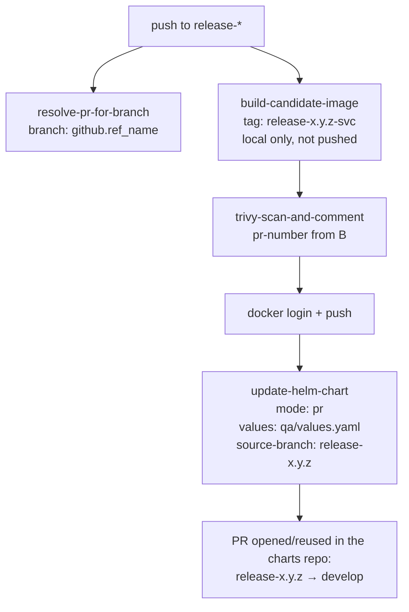

# QA release pipeline (`qa-release.yml`)

The QA stage: a push to a `release-*` branch builds and scans that branch's
image, pushes it, then opens a PR in the Helm-charts repo bumping the QA
values file. It reuses the same composite actions as
[`dev-pipeline.md`](dev-pipeline.md) — `build-candidate-image`,
`trivy-scan-and-comment`, `update-helm-chart` — plus `resolve-pr-for-branch`,
which only this stage needs.

## Flow

## Why it calls `resolve-pr-for-branch` first

Dev's scan comments work for free because `pull_request` events carry a PR
number in the event payload. A `push` to `release-*` carries no such thing —
there may or may not be an open PR for that branch when the pipeline runs.
`resolve-pr-for-branch` looks one up by branch name and returns empty, not an
error, if none exists yet; that empty value flows into
`trivy-scan-and-comment`'s `pr-number` input, which then skips the comment
step (the report still uploads) rather than failing the job.

## Why QA updates the charts repo through a PR

Dev pushes its values bump straight to `develop` in the charts repo. QA
doesn't: it checks out a `release-*` branch **in the charts repo**, commits
there, and opens a PR into `develop`.

QA is the first environment change a human actually reviews before it lands
on `develop`, so gating it behind a PR is the point of the stage. The cost is
that the charts repo needs a branch matching the release branch name — if it
doesn't exist, the checkout fails before anything is committed.

| | Dev | QA |
|---|---|---|
| Trigger | PR + push to `develop` | push to `release-*` |
| Image tag | `<commit-sha>-<service>` | `<release-branch>-<service>` |
| Values file | `dev/values.yaml` | `qa/values.yaml` |
| Update mode | `direct-commit` | `pr` |
| Image origin | promoted by digest from the PR build | rebuilt from the release branch |

## Known tradeoff: QA rebuilds instead of promoting a digest

Unlike dev, QA does not reuse `promote-candidate-image` — it rebuilds from
source via `build-candidate-image` and scans the rebuild, rather than
promoting whatever digest dev already scanned.

That's defensible rather than accidental: a `release-*` branch can carry
cherry-picks that never went through a dev PR, so the artifact genuinely
isn't the one dev scanned, and re-scanning is the honest thing to do. It does
mean QA's image is a *different build* of possibly identical source, so don't
read a matching tag as a matching digest.

## Credential

`update-helm-chart` pushes to a different repo, which `GITHUB_TOKEN` can
never do. The job mints a short-lived GitHub App token per run — one-time
setup in [`github-app-setup.md`](github-app-setup.md). In `pr` mode the App
needs **Pull requests: Read and write** on top of Contents.

## Per-repo configuration

Same as dev: one entry per repo in
[`pipelines/repos.yaml`](../../pipelines/repos.yaml), rendered by
`scripts/install-pipeline.sh`. `helm_key` and `service_name` are shared
across both stages — only the values-file path differs, and that's fixed per
stage in the templates.
