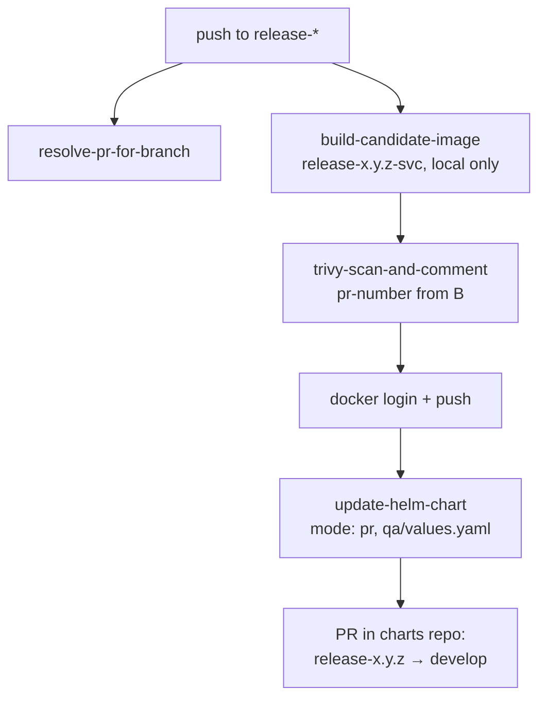

# QA release pipeline (`qa-release.yml`)

A push to `release-*` builds and scans that branch's image, pushes it, then
opens a PR in the charts repo bumping `qa/values.yaml`. Same actions as
[dev](dev-pipeline.md), plus `resolve-pr-for-branch`, which only this stage
needs.

## Flow

## Dev vs QA

| | Dev | QA |
|---|---|---|
| Trigger | PR + push to `develop` | push to `release-*` |
| Image tag | `<commit-sha>-<service>` | `<release-branch>-<service>` |
| Values file | `dev/values.yaml` | `qa/values.yaml` |
| Update mode | `direct-commit` | `pr` |
| Image origin | promoted by digest | rebuilt from the release branch |

## Why `resolve-pr-for-branch` runs first

Dev gets a PR number free from the `pull_request` payload. A `push` to
`release-*` doesn't — there may or may not be an open PR. The action looks one
up by branch and returns **empty rather than erroring**; that empty value
makes `trivy-scan-and-comment` skip its comment (the report still uploads)
instead of failing the job.

## Why QA goes through a PR

Dev pushes its values bump straight to `develop`. QA commits to a `release-*`
branch **in the charts repo** and opens a PR instead, because QA is the first
environment change a human reviews before it reaches `develop`.

The cost: the charts repo needs a branch matching the release branch name. If
it doesn't exist, checkout fails before anything is committed.

## Known tradeoff: QA rebuilds

QA doesn't reuse `promote-candidate-image` — it rebuilds from source and scans
the rebuild. That's defensible: a `release-*` branch can carry cherry-picks
that never went through a dev PR, so re-scanning is honest. But it means QA's
image is a *different build* of possibly identical source — don't read a
matching tag as a matching digest.

## Credential

`update-helm-chart` pushes cross-repo, which `GITHUB_TOKEN` can't do. The job
mints a GitHub App token per run ([setup](github-app-setup.md)). In `pr` mode
the App needs **Pull requests: Read and write** on top of Contents.
